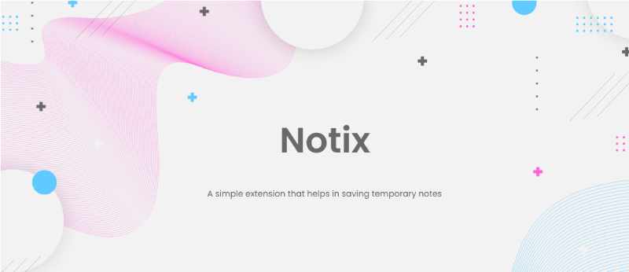

<div align="center">

 $\huge\textcolor{purple}{\text{Notix}}$

$\small\textcolor{purple}{\textit{Saving temporary notes extension}}$

  
  
  
  
  <a href="LICENSE"></a>
  <!-- <a href="https://hits.dwyl.com/thuongtruong1009/notix" rel="nofollow"></a> -->

</div>



## 📢 About

-   Notix is a simple extension that helps in saving temporary notes. It is built with HTML, CSS and JavaScript based on Chrome manifest verion 3. It is cross-browser compatible extension that means it can be used on any browser.

## 📸 Preview

|                                                              |                                                              |
| :----------------------------------------------------------: | :----------------------------------------------------------: |
|  |  |
|  |  |
|  |  |
|                                                              |                                                              |

## 🎉 What's new

✔️ Create new notes, edit note data, delete selected notes, clear text, and dispatch notes data with unlimited storage time <br/>
✔️ Copy note as text, image to the clipboard <br/>
✔️ Export/download notes data as .txt files, .png images <br/>
✔️ Share note via image link <br/>
✔️ Voice to text (only English) <br/>
✔️ Audio reading text <br/>
✔️ Auto save typed note text <br/>
✔️ Not reset data when closing the browser <br/>
✔️ Display notes information (total notes, name - size - total words - total lines - created - last update time of current note, etc.) <br/>
✔️ Cross-browsers compatibility (Chrome, Firefox, Edge, Opera, Brave, etc.) <br/>
✔️ UI/UX friendly (transition, shadow effect, gradient color etc.) <br/>
✔️ Setting options (dark mode, fonts, auto-save, auto-sync, audio-options etc.) <br/>
✔️ Search notes by name <br/>

## 🎯 Todo

-   [ ] Scroll to top button
-   [ ] Filter notes by created time, last updated time, etc.
-   [ ] Password protection for secret notes
-   [ ] Detect language translation of note text
-   [ ] Export/import notes backup data
-   [ ] Real-time sync notes data between tabs
-   [ ] Insert image to text
-   [ ] Text editor tool panel
-   [ ] Localization

## 🧩 Built With

-   [HTML](https://www.w3schools.com/html/)
-   [CSS](https://www.w3schools.com/css/)
-   [JavaScript](https://www.w3schools.com/js/)
-   [Chrome extension](https://developer.chrome.com)

<!-- ## 📚 Documentation

## 📝 Usage -->

## 📦 Download

-   [Zip package format](https://thuongtruong109.github.io/notix/notix.zip)

## 🔨 Development

-   Star this repository

-   Clone the repository

```bash
git clone https://github.com/thuongtruong109/notix.git
```

-   **On browser** -> **Settings** -> **Extensions** -> **Developer mode (open $\textcolor{blue}{\text{chrome://extensions/}}$ for chrome)** -> **Load unpacked** -> **Select the cloned folder**

## 📄 Changelog

-   Track development at [Changelog](https://thuongtruong1009.github.io/notix/changelog.html)

## 🛡️ Credits

This project is licensed under the [GNU General Public v3.0](LICENSE)

Copyright of [@thuongtruong109](https://github.com/thuongtruong109), 2023

## ❤️ Support me

> <a href="https://nhantien.momo.vn/0917085937"></a> <a href="https://www.paypal.me/thuongtruong1009"></a> <a href='https://ko-fi.com/thuongtruong1009'></a> <a href="public/mb_qr.jpg"></a>

## 📧 Contact

-   Email: [thuongtruongofficial](mailto:thuongtruongofficial)
